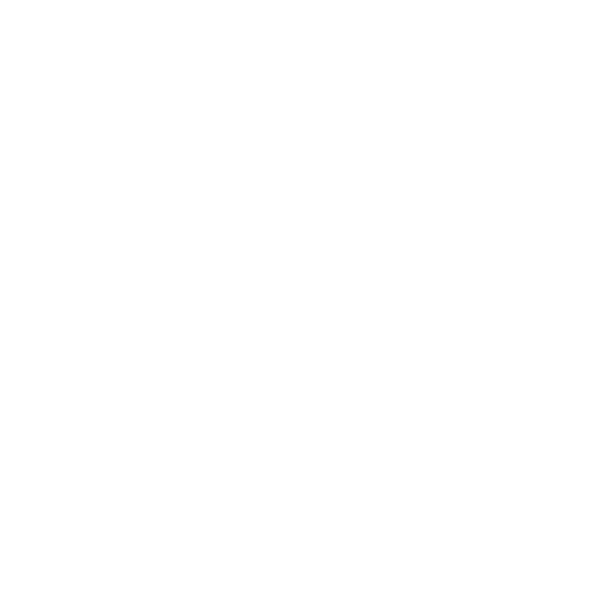

<div>
  <a href="https://github.com/antonkomarev/github-profile-views-counter">
    
  </a>
  <a href="https://github.com/chetanraj/awesome-github-badges">
    
  </a>
  <a href="https://badges.pufler.dev">
    
  </a>
  <a href="https://github.com/Amir-Pourhadi?tab=repositories">
    
  </a>
  <a href="https://badges.pufler.dev">
    
  </a>
  <a href="https://microsoft.com/en-us/windows">
    
  </a>
  <a href="https://google.com/chrome" >
    
  </a>
  <a href="https://code.visualstudio.com">
    
  </a>
</div>
  
<h1> < Hello, World! 😎 /> </h1>

> **I'm Amir, 👨🏻‍💻 Full Stack Web Developer from Esfahan, Iran.**

<details>
  <summary><b>🎓 My Knowledge</b></summary><br>

  <a href="https://edclub.com/typingclub">
    
  </a>
  <a href="https://prettier.io">
    
  </a>
  <a href="https://git-scm.com">
    
  </a>
  <a href="https://github.com">
    
  </a>
  <a href="https://gitlab.com">
    
  </a>
  <a href="https://bitbucket.org">
    
  </a>
  <br>
  <a href="https://developer.mozilla.org/en-US/docs/Web/HTML">
    
  </a>
  <a href="https://developer.mozilla.org/en-US/docs/Web/CSS">
    
  </a>
  <a href="https://sass-lang.com">
    
  </a>
  <a href="https://getbootstrap.com">
    
  </a>
  <a href="https://developer.mozilla.org/en-US/docs/Web/JavaScript">
    
  </a>
  <a href="https://jquery.com">
    
  </a>
  <br>
  <a href="https://reactjs.org">
    
  </a>
  <a href="https://redux.js.org">
    
  </a>
  <a href="https://npmjs.com">
    
  </a>
  <a href="https://reactrouter.com">
    
  </a>
  <a href="https://styled-components.com">
    
  </a>
  <br>
  <a href="https://nodejs.org">
    
  </a>
  <a href="https://babeljs.io">
    
  </a>
  <a href="https://webpack.js.org">
    
  </a>
  <a href="https://eslint.org">
    
  </a>
  <a href="https://expressjs.com">
    
  </a>
  <a href="https://mongodb.com">
    
  </a>
  <a href="https://postman.com">
    
  </a>
  <br>
  <a href="https://netlify.com">
    
  </a>
  <a href="https://heroku.com">
    
  </a>
  <a href="https://ubuntu.com">
    
  </a>
  <a href="https://trello.com">
    
  </a>
  <a href="https://adobe.com/products/xd.html">
    
  </a>
  <a href="https://adobe.com/products/photoshop.html">
    
  </a>
  <br>
  <a href="https://microsoft.com/en-us/microsoft-365">
    
  </a>
  <a href="https://microsoft.com/en-us/microsoft-365/word">
    
  </a>
  <a href="https://microsoft.com/en-us/microsoft-365/powerpoint">
    
  </a>
  <a href="https://microsoft.com/en-us/microsoft-365/excel">
    
  </a>
  <a href="https://microsoft.com/en-us/microsoft-365/access">
    
  </a>
  <a href="https://microsoft.com/en-us/microsoft-365/outlook">
    
  </a>
</details>

<details>
  <summary><b>🔗 My Links</b></summary><br>

  <a href="https://t.me/AmirPourhadiOfficial">
    
  </a>
  <a href="https://facebook.com/AmirPourhadiOfficial">
    
  </a>
  <a href="https://twitter.com/AmirPourhadi">
    
  </a>
  <a href="https://instagram.com/amir.pourhadi.official">
    
  </a>
  <a href="https://linkedin.com/in/amirpourhadi">
    
  </a>
  <a href="https://pinterest.com/Amir_Pourhadi">
    
  </a>
  <a href="mailto:Alex.CE1379@Gmail.com">
    
  </a>
  <a href="https://reddit.com/u/AmirPourhadi">
    
  </a>
  <a href="https://sololearn.com/profile/19964067">
    
  </a>
  <a href="https://github.com/Amir-Pourhadi">
    
  </a>
  <a href="https://gitlab.com/Amir-Pourhadi">
    
  </a>
  <a href="https://bitbucket.org/Amir-Pourhadi">
    
  </a>
  <a href="https://wakatime.com/AmirPourhadi">
    
  </a>
  <a href="https://freecodecamp.org/amirpourhadi">
    
  </a>
  <a href="https://trello.com/amir_pourhadi_projects">
    
  </a>
  <a href="https://codewars.com/users/AmirPourhadi">
    
  </a>
  <a href="https://stackoverflow.com/users/story/14383648">
    
  </a>
  <a href="https://meta.stackexchange.com/users/860571">
    
  </a>
  <a href="https://postman.com/AmirPourhadi">
    
  </a>
  <a href="https://codecademy.com/profiles/AmirPourhadi">
    
  </a>
  <a href="http://khanacademy.org/profile/AmirPourhadi">
    
  </a>
  <a href="https://codepen.io/AmirPourhadi">
    
  </a>
  <a href="https://udemy.com/user/amir-pourhadi">
    
  </a>
  <a href="https://open.spotify.com/user/ele6ia7z9ie34ipjmg62339sz?si=050835b00f474142">
    
  </a>
  <a href="https://discordapp.com/users/782137480475574272">
    
  </a>
  <a href="https://steamcommunity.com/id/AmirPourhadi">
    
  </a>
  <a href="https://coursera.org/user/c3aee4f1d1283b3c52664ee0ef750a9f">
    
  </a>
  <a href="https://join.skype.com/invite/AmtP0vzD7bWp">
    
  </a>
</details>

<details>
  <summary><b>📈 My GitHub Stats</b></summary><br>

  <div>
    <a href="https://github-readme-stats.vercel.app">
      
    </a>
    <a href="https://github.com/DenverCoder1/github-readme-streak-stats">
      
    </a>
  </div>
  <div>
    <a href="https://github-readme-stats.vercel.app">
      
    </a>
    <a href="https://wakatime.com/AmirPourhadi">
      
    </a>
  </div>
</details>

<details>
  <summary><b>🏆 My Github Profile Trophies</b></summary><br>

  <a href="https://github.com/ryo-ma/github-profile-trophy">
    
  </a>
</details>

<details>
  <summary><b>📊 My Coding Stats</b></summary><br>

  <a href="https://codewars.com/users/AmirPourhadi">
    
  </a><br>
  
  <!--START_SECTION:waka-->


**I'm a Night 🦉** 

```text
🌞 Morning    127 commits    ███░░░░░░░░░░░░░░░░░░░░░░   15.16% 
🌆 Daytime    257 commits    ███████░░░░░░░░░░░░░░░░░░   30.67% 
🌃 Evening    336 commits    ██████████░░░░░░░░░░░░░░░   40.1% 
🌙 Night      118 commits    ███░░░░░░░░░░░░░░░░░░░░░░   14.08%

```
📅 **I'm Most Productive on Saturday** 

```text
Monday       96 commits     ██░░░░░░░░░░░░░░░░░░░░░░░   11.46% 
Tuesday      164 commits    █████░░░░░░░░░░░░░░░░░░░░   19.57% 
Wednesday    73 commits     ██░░░░░░░░░░░░░░░░░░░░░░░   8.71% 
Thursday     71 commits     ██░░░░░░░░░░░░░░░░░░░░░░░   8.47% 
Friday       100 commits    ███░░░░░░░░░░░░░░░░░░░░░░   11.93% 
Saturday     185 commits    █████░░░░░░░░░░░░░░░░░░░░   22.08% 
Sunday       149 commits    ████░░░░░░░░░░░░░░░░░░░░░   17.78%

```


📊 **This Week I Spent My Time On** 

```text
💬 Programming Languages: 
Markdown                 9 hrs 6 mins        █████████████████░░░░░░░░   68.33% 
HTML                     1 hr 7 mins         ██░░░░░░░░░░░░░░░░░░░░░░░   8.42% 
CSS                      53 mins             █░░░░░░░░░░░░░░░░░░░░░░░░   6.64% 
Other                    47 mins             █░░░░░░░░░░░░░░░░░░░░░░░░   5.89% 
JavaScript               42 mins             █░░░░░░░░░░░░░░░░░░░░░░░░   5.33%

🐱‍💻 Projects: 
Amir-Pourhadi            9 hrs 44 mins       ██████████████████░░░░░░░   73.03% 
Barber-Shop              32 mins             █░░░░░░░░░░░░░░░░░░░░░░░░   4.09% 
Unknown Project          16 mins             ░░░░░░░░░░░░░░░░░░░░░░░░░   2.1% 
Calculator               16 mins             ░░░░░░░░░░░░░░░░░░░░░░░░░   2.03% 
About-IMD                15 mins             ░░░░░░░░░░░░░░░░░░░░░░░░░   1.92%

```

**I Mostly Code in JavaScript** 

```text
JavaScript               16 repos            ██████████████░░░░░░░░░░░   57.14% 
HTML                     8 repos             ███████░░░░░░░░░░░░░░░░░░   28.57% 
CSS                      3 repos             ██░░░░░░░░░░░░░░░░░░░░░░░   10.71% 
Java                     1 repo              █░░░░░░░░░░░░░░░░░░░░░░░░   3.57%

```


 Last Updated on 05/10/2021
<!--END_SECTION:waka-->
  
  [](https://hit.yhype.me/github/profile?user_id=48559675)
</details>


